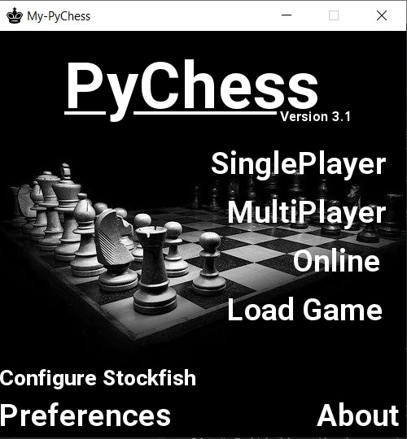

# My-PyChess

A fully featured chess application written in Python using the pygame library.



## How to Run

1. **Install Requirements**:
   ```
   pip install pygame
   ```

2. **Run the Game**:
   ```
   python pychess.py
   ```

## Features

- **Multiple Game Modes**:
  - **SinglePlayer**: Play against a Python-based AI or the Stockfish chess engine
  - **MultiPlayer**: Play locally with a friend
  - **Online**: Play with others over the internet
  - **Load Game**: Continue previously saved games

- **Game Features**:
  - Chess timer
  - Save/load functionality
  - Valid move highlighting
  - Check/checkmate/stalemate detection
  - Special moves (castling, en passant, pawn promotion)
  - Undo move option

- **Customization**:
  - Preferences menu to adjust settings
  - Board flip option
  - Sound toggle

## Stockfish Integration

For advanced AI gameplay, the app supports Stockfish chess engine:
1. Go to "Configure Stockfish" in the main menu
2. Follow the installation guide for your operating system
3. Test the installation before playing

## Project Structure

- `chess/`: Core chess gameplay modules
- `menus/`: UI menu screens
- `res/`: Resources (images, sounds, saved games)
- `tools/`: Utility modules
- `ext/`: External modules (textbox, Stockfish interface)

## Online Play

Self-host the My-PyChess server by running:
```
python server.py
```
See `onlinehowto.txt` for more details.

## Screenshots

See [screenshots/screenshots.md](screenshots/screenshots.md) for more images of the game in action.
